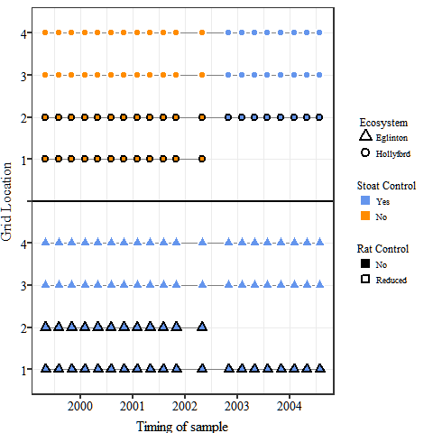

```{r global-options, message=FALSE, warning=FALSE, include=FALSE}
# export .r code only
# knitr::purl("./Davidson_2019_BeechForest.Rmd")

# render draft to webpage
# rmarkdown::render(input = "Davidson_2019_BeechForest.Rmd")
# ,
#                   output_format = "html_document",
#                   output_file = "Davidson_2019_t.html")

#document global rules
knitr::opts_chunk$set(comment=NA,
                      fig.path = "./figs/",
                      message=FALSE, 
                      warning=FALSE)
# how do I do this??
# ,eval = FALSE,include = FALSE

# libraries needed
source("./rcode/r-packages-needed.R", echo = FALSE)

# themes
source("./Rcode/davidson_2019_theme.r", echo = FALSE)

#overall code
source("./rcode/manuscript-source-code.R", echo = FALSE)
```

Stoat control does not lead to larger mouse eruptions in New Zealand beech forest (Figure 1).

## Other title options

- Food vs. Predation? What drives mice populations in New Zealand beech forests.
- Stoat control make things better for our native species.
- Population dynamics of mice are not affected by stoat control in New Zealand beech forests.
- Mesopredator release is not a likely outcome of stoat control in New Zealand Beech Forests.
- Merky forests. What can we expect from stoat control in NZ forests

## Summary

<- re-write ->

*"This is too a narrow focus. Your paper tests whether stoat control affects mouse population dynamics in beech forest. The conflicting outcomes from previous studies provides a motivation for this more comprehensive field study"* **Richard**

This publication clarifies the discrepancy between; two modelling papers that suggest mesopredator release of rodents is possible in New Zealand forest systems and; several field studies that have presented limited but conflicting support for increases in mouse abundance following predator control. We used an experimental design to test the differences between the two "frames of though" and found that there is no evidence to suggest mice will become more abundant after predator removal ([*additional resources can be found here*](https://www.ssnhub.com/Invasive-species-modeling)).

## Introduction

Worldwide, but particularly on islands, introduced mammalian predators can have significant impacts on native species [@towns2006]. New Zealand's (NZ) remaining native forests commonly contain four introduced mammalian predators; stoats (*Mustela erminea*; [@veale2015a]), brushtail possums (*Trichosurus vulpecula Kerr*; [@clout1984]), ship rats (*Rattus rattus*; [@innes2005] referred to as rats), and house mice (*Mus mus musculus*; [@allen2006]). In NZ forests, stoats are the top predator following their deliberate introduction in the late nineteenth century [@king2017]. Stoat control is now commonly undertaken to protect native birds that are vulnerable to predation [@white2006], in particular, hole-nesting species like mohua (*Mohoua ochrocephala* [@odonnellPredictingIncidenceMohua1996]). However, the primary food source for stoats in NZ forests are rats and mice [@white2006] and there is a concern that reducing stoat populations to protect native birds may allow rodent populations to increase (e.g [@rayner2007]). An increase in the number of rats and mice could offset the benefits of stoat control because rodent populations are known to consume the eggs and chicks of native birds [@allen2006], directly compete for food resources such as the flowers and seeds of native flora [@mcqueen2008] and predate on invertebrates [@ruscoe2013]. In this paper we address the critical question: "does stoat control lead to increased abundance of rodents, particularly mice, in NZ beech forests?

Studies elsewhere in the world have shown that removing or reducing the abundance of a top predator often results in release of predators at a lower trophic level (termed mesopredator release), which in turn, can lead to unintended and often negative outcomes for native species (overall review see [@prugh2009]; examples see [@rayner2007; @robles2002]). While mesopredator release has been widely documented, it is unclear if stoat control in NZ forests will cause rodent populations to increase. Rodent populations are known to respond strongly to variation in food supply [@latham2017], primarily seed availability in NZ forests (Figure 1).

```{r figure-one-result-plot1, fig.cap=cap.pred, message=FALSE, warning=FALSE}
#data file
source("./rcode/ecosystem-simulation/sim-raw-data.R", echo = FALSE)

#file code
source("./Rcode/ecosystem-simulation/sim-code-plot.R", echo = FALSE)

#plot
result.plot


cap.pred <- c("**Figure 1:** *Each arrow and label represents a prediction we tested (Prediction B to D). Each prediction represents a collection of previous studies that have suggested how mouse populations may respond to seed availability in the presence or absence of stoats. A) during the years when no seed is available (non-mast years; Panel A); B) at the peak of mouse abundance (winter or spring); C) the season when mice populations are responding rapidly to increasing seed abundance (summer to winter in mast years; Panel B); D) when mouse abundance declines (spring to summer; Panel B).  The top panel represents the average seed availability cycle in New Zealand Native Beech Forests between non-mast (no shading) and mast years (shaded grey). The bottom panel represents the expected response of mouse abundance ($N_{j,t}$) to the variation in seed availability ($Seed_{j,t}) above where solid yellow symbols represent locations where stoats are un-controlled*")
```



```{r, echo=TRUE,out.width="49%", out.height="20%",fig.cap="caption",,fig.align='center'}
knitr::include_graphics(c("./figs/fig-1.jpeg","./figs/1560646501630.png"))
```

This is particularly pronounced in beech forests where between years, beech seed production is highly variable with little seed produced in most years (Figure 1: non-mast years) and occasional years of substantial seed production (Figure 1: mast years). Mouse populations remain low in non-mast years, primarily due to low food availability (Figure 1b; **Prediction A** = label "A"; @choquenot2000, @king1983). In mast years, when seed becomes abundant, mouse populations can increase rapidly but show predictable fluctuations in response to seasonal changes in beech seed availability (Figure 1b: **Prediction B to D** = label "B-D"; ). Seed begins to fall in late summer and begins to accumulate on the forest floor, allowing mouse populations to increase from late summer onward, with mouse populations typically remaining high through winter and into the following spring. Beech seed that is not consumed by mice and other seed predators, then germinates in spring to early summer, meaning this food resource disappears and mouse populations begin to decline. If the following year is a non-mast year and little further seed becomes available, mouse populations fall to low levels. It is unclear whether stoats could exert sufficiently strong predation pressure to alter these food-driven population eruptions.

Previous research has investigated the likely response of mouse populations to stoat control by modelling the outcome of interactions between stoats, mice and seed availability. @blackwell2001 simulated this relationship and predicted that stoat predation should have minimal effects on the population dynamics of mice, identifying different phases in the eruption cycles where stoats could have an effect (Figure 1). In a subsequent study [@blackwell2003]Specifically, they examined how stoat control could influence mouse populations at the peak (Prediction B), decline (**Prediction C**) or low (**Prediction A**) phase of the eruption cycle.

**<- is this too critical given ?... ->**

However, the limited geographical scale of the study, low statistical power and replication between different forest types makes it difficult to compare the effect of different treatment types during the four different seasons.

Repleccate and extend on larger scale.
**<- is this too critical given ?... ->**

The effects of stoat control on mice and rats are therefore still unclear in NZ beech forests [@blackwell2003]. More recently, the population dynamics of interacting invasive mammals in NZ forests have also incorporated the interactions between mice, rats, possums and stoats [@blackwell2001; @blackwell2003; @tompkins2006; @tompkins2013]. Tompkins and colleagues simulated different predator removal scenarios and found:

1) stoat removal through trapping caused rats but not mice to increase in the subsequent year;

2) removal of both rats and mice lead to lower numbers of stoats in the following years;

3) mice numbers only increased during model simulations if rats or both rats and stoats were removed.

<- check on this and explain better ->

The community models [@tompkins2006; @tompkins2013] suggested two additional relationships between mice and rats as well as stoats and rodents (**Prediction E**). Laboratory experiments indicate that mice and rats avoid interactions [@bridgman2013]. These relationships were not as clear in field studies where the removal of rats in mixed-forests [@ruscoe2011] did result in increased abundance of mice populations but this was not observed in beech forest studies[@blackwell2003].

Our aim was to test the predictions outlined in both @blackwell2003 and @tompkins2006 using data from a large-scale field study. Specifically, we measured the abundance of mice and rats over six years in beech forest in two adjacent valleys, one with stoat trapping and one without. In each valley we also manipulated rat densities by including treatment areas where rats were trapped to compare these to areas without rat trapping. This allowed us to examine the response of mouse populations to stoat removal, and to determine if those responses were influenced by interactions with rats.

## References

```{r eval=FALSE, message=FALSE, warning=FALSE, include=TRUE}
  write.bibtex(file="export.bib")
```
