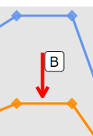

<a href="{{ site.github.repository_url }}/tree/master/{{ page.relative_path }}" align = "center">Help make it better here</a>

```{r global-options, message=FALSE, warning=FALSE, include=FALSE}
library("dplyr")
library("knitr")
library("docxtools")
# export .r code only
# knitr::purl("./Davidson_2019_BeechForest.Rmd")

# render draft to webpage
# rmarkdown::render(input = "Davidson_2019_BeechForest.Rmd")
# ,
#                   output_format = "html_document",
#                   output_file = "Davidson_2019_t.html")

# compareGroups::cGroupsGUI(mtcars)
#document global rules
knitr::opts_chunk$set(comment=NA,
                      fig.path = "../figs/",
                      echo=FALSE, 
                      fig.height=6, 
                      fig.width=10,
                      message=FALSE, 
                      warning=FALSE)
# how do I do this??
# ,eval = FALSE,include = FALSE

# formatR
```

```{r eniviroment, message=FALSE, warning=FALSE, include=FALSE}
# libraries needed
source("./R/r-packages-needed.R", echo = FALSE)
source("./R/theme_raw_fig3s.r", echo = FALSE)
source("./R/davidson_2019_theme.r", echo = FALSE)

# adding info from old manuscript for now
# source("./R/manuscript-source-code.R", echo = FALSE)

# not working
# source("./Davidson_2019_Data_wrangling.Rmd", echo = FALSE, )
```

| Prediction A                                       | Prediction B                                      |
| -------------------------------------------------- | ------------------------------------------------- |
| At times of low abundance                          | At times of high abundance                        |
|  |  |

# Introduction

At times of high and low abundance there is evidence that mice populations are likely to be under different population pressures. It has been shown that population level processes such as density dependance (competition between individuals for space or resources) when populations are at high abundance [@ruscoe2005]. But at low abundance the demographic processes limiting populations are different, namely resource avaliability rather than competition [@choquenot2000]. Because these two demographic processes are fundementally different we need to test these times independant of each other. We can then be sure that one phase/season is not obscurring the processes of the other.

# Methods

Using simple ANOVA methods for mixed models making the following assumptions:

1. Unequal variances 
2. Unequal sample sizes
3. Non-independence removed 
   - by partitioning groups by phase.
4. Seasons vary through time
   - phases don't

## Low abundance

How to choose what groups to compare?

### Data selection

We have chosen to select trips 10 -> 15 as times of low abundance.

```{r}
# ANOVA and plot set-up
# March 2019

# selected group
# reduce to low abundance only data only
low <- c(10,11,12,13,14,15) 
```

### Data manipulation

This dataset is generated from a combination of the modified data and uses the Bayesian model estimates of abundance but does not use any of the model coefficients currently. 

Therefore we use the overall dataset including all $144$ replicates rather than the reduced $r_{j,t}$.

```{r}
# source("./Davidson_2019_Data_wrangling.R", echo = FALSE)
plot.dat.all1 <- read_csv("./data/plot-all-data1.csv")
# head(abund.dat5)
low.abund.dat <- plot.dat.all1 %>% 
  # mutate(N = mean.lam) %>%  # for when using out.N
  filter(trip == 10 | trip == 11 | trip == 12 | trip == 13 | trip == 14 | trip == 15)
# filter(low.abund.dat, trip.no == 15)$true.date
```

We can summarise the data over valleys, control areas and/or treatments to compare the means and variances.

```{r}
# summary for plots
# create summarised datasets of need
low.cond.sum <- low.abund.dat %>%
  group_by(Control,Valley,Conditions) %>%
  summarise(N.count = n(),
            N = mean(N, rm.na = TRUE),
            tvalue = qt(p = 0.025, df = N.count - 1, lower.tail = FALSE),
            low.se = mean(se.N),
            lcl.low.tv = N - (tvalue*low.se),
            ucl.low.tv = N + (tvalue*low.se),
            lcl.low = N - (1.96*low.se),
            ucl.low = N + (1.96*low.se))

low.con <- low.abund.dat %>%
  group_by(Control)  %>%
  summarise(N.count = n(),
            N = mean(N, rm.na = TRUE),
            tvalue = qt(p = 0.025, df = N.count - 1, lower.tail = FALSE),
            low.se = mean(se.N),
            lcl.low.tv = N - (tvalue*low.se),
            ucl.low.tv = N + (tvalue*low.se),
            lcl.low = N - (1.96*low.se),
            ucl.low = N + (1.96*low.se))

low.con1 <- low.con %>%
              mutate(lcl.low = ifelse(lcl.low < 0, 0, lcl.low))
```

These comparisons would be fine but there are un-equal replicates and other issues that we need to account for using a ANOVA or mixed model.

### Statistical models

```{r}
# reducing dataset for simplicity
# test.dat.1 <- low.abund.dat %>%
#   select(N, valley, control, Conditions, trip, grid, grid.n, month,year)
```

#### Control only

```{r}
low.mod1 <- glm(N ~ Control, family = "gaussian", data = low.abund.dat)
summary.low.mod1 <- summary(low.mod1)

low.mod1.fun <- anova(low.mod1, test = "F") %>%
    format_engr()

low.mod1.fun
```

#### Control and valley

```{r}
low.mod2 <- glm(N ~ Control + valley, family = "gaussian", data = low.abund.dat)
summary.low.mod2 <- summary(low.mod2)

low.mod2.fun <- anova(low.mod2, test = "F") %>%
    format_engr()

low.mod2.fun
```

#### Control, valley and conditions

```{r}
low.mod3 <- glm(N ~ Control + Valley + Conditions, family = "gaussian", data = low.abund.dat)
summary.low.mod3 <- summary(low.mod3)
low.mod3.fun <- anova(low.mod3, test = "F") %>%
    format_engr()

low.mod3.fun
```

##### Log(N) for interest

```{r}
low.mod3.log <- glm(log(N) ~ Control + Valley + Conditions, family = "gaussian", data = low.abund.dat)
summary.low.mod3.log <- summary(low.mod3.log)

low.mod3.log.fun <- anova(low.mod3.log, test = "F") %>%
    format_engr()

low.mod3.log.fun
```

#### Full model

```{r}
low.mod4 <- glm(N ~ Control + Valley + Conditions + Control:Conditions, family = "gaussian", data = low.abund.dat)
summary.low.mod4 <- summary(low.mod4)

low.mod4.fun <- anova(low.mod4, test = "F") %>%
    format_engr()

low.mod4.fun
```

#### Model selection

```{r}
mods.name <- c("low.mod1", "low.mod2", "low.mod3")
model.aic <- c(summary.low.mod1$aic,summary.low.mod2$aic,summary.low.mod3$aic)


mod.dev <- c(summary.low.mod1$deviance,summary.low.mod2$deviance,summary.low.mod3$deviance)

#dataset output
mod.selection <- tibble(model.aic = model.aic,
                        mods.name = mods.name,
                        mod.dev = mod.dev)

# kable(mod.selection)
```

## High abundance

### Data selection

```{r}
# High (B) abundance (n_jt) prediction 
# ANOVA and plot set-up
# March 2019

# glimpse(high.abund.dat)
# table(high.abund.dat$trip, high.abund.dat$valley)
# unique(filter(high.abund.dat, trip == 6)$true.date)
# unique(filter(high.abund.dat, trip == 7)$true.date)
# unique(filter(high.abund.dat, trip == 16)$true.date)
# unique(filter(high.abund.dat, trip == 17)$true.date)

# reduce to low abundance only data only
high.abund.dat <- plot.dat.all1 %>%
  filter(trip.no == 6 | trip.no == 7 | trip.no == 16 | trip.no == 17 )  %>%
  mutate(n.seed.l = N/log.seed,
         n.seed.c = N/cum.seed) %>%
  droplevels()  %>%
  mutate(n.seed.l = ifelse(n.seed.l > 10000 , 0, n.seed.l),
         n.seed.c = ifelse(n.seed.c > 10000 , 0, n.seed.c))
```

### Data manipulation

```{r}
# summary for plots
# create summarised datasets of need
high.cond.sum <-  high.abund.dat %>%
  group_by(Control, Valley, Conditions) %>%
  summarise(N.count = n(),
            mean.seed.c = mean(n.seed.c, rm.na = TRUE),
            tvalue = qt(p = 0.025, df = N.count - 1),
            high.sd = sd(n.seed.c),
            high.se = sd(n.seed.c)/sqrt(N.count),
            lcl.high.tv = mean.seed.c - (tvalue* high.se),
            ucl.high.tv = mean.seed.c + (tvalue* high.se),
            lcl.high = mean.seed.c - (1.96* high.se),
            ucl.high = mean.seed.c + (1.96* high.se))

high.con <-  high.abund.dat %>%
  group_by(Control) %>%
  summarise(N.count = n(),
            mean.seed.c = mean(n.seed.c, rm.na = TRUE),
            tvalue = qt(p = 0.025, df = N.count - 1),
            high.sd = sd(n.seed.c),
            high.se = sd(n.seed.c)/sqrt(N.count),
            lcl.high.tv = mean.seed.c - (tvalue* high.se),
            ucl.high.tv = mean.seed.c + (tvalue* high.se),
            lcl.high = mean.seed.c - (1.96* high.se),
            ucl.high = mean.seed.c + (1.96* high.se))

test.dat.2 <- high.abund.dat %>%
  select(N, Valley, Control, Conditions, trip, grid, n.seed.c)

high.plot.avo <-   high.abund.dat %>%
  mutate(pt.pts = as.numeric(factor(paste(Valley, Control,Conditions))),
         pt.ft = factor(paste(valley, control, Conditions)),
         pt.ft.g2 = factor(paste(valley, control, Conditions)),
         valley = factor(valley, labels =  c("Eglinton", "Hollyford")),
         Conditions = factor(Conditions),
         control = factor(control))

```

##### Structuring levels

```{r}
# names(high.plot.avo)
# factor(plot.dat2$pt.pts)
# factor(plot.dat2$pt.ft.g2)
levels(high.plot.avo$pt.ft.g2) <- c("egl control rats.present",
                                    "egl control rats.removed" ,    
                                    "hol no control rats.present", 
                                    "hol no control rats.removed",
                                    "hol control rats.present", 
                                    "hol control rats.removed")

levels(high.plot.avo$pt.ft.g2) <- c(3,3,2,2,2,2)

# test.dat.1 <- high.abund.dat %>%
#   select(N, valley, control, Conditions, trip, grid, n.seed.c)
```

### Statistical models

```{r}
# high.mod1
high.mod1 <- glm(n.seed.c ~ Control, family = "gaussian", data = high.abund.dat)
summary.high.mod1 <- summary(high.mod1)

high.mod1.fun <- anova(high.mod1, test = "F") %>%
    format_engr()

high.mod1.fun

```

```{r}
# high.mod2
high.mod2 <- glm(n.seed.c ~ Control + Valley, family = "gaussian", data = high.abund.dat)
summary.high.mod2 <- summary(high.mod2)

high.mod2.fun <- anova(high.mod2, test = "F") %>%
    format_engr()

high.mod2.fun

```

```{r}
#high.mod3
high.mod3 <- glm(n.seed.c ~ Control + Valley + Conditions, family = "gaussian", data = high.abund.dat)
summary.high.mod3 <- summary(high.mod3)

high.mod3.fun <- anova(high.mod3, test = "F") %>%
    format_engr()

high.mod3.fun
```

```{r}
#high.mod3
high.mod4 <- glm(n.seed.c ~ Control + Valley + Conditions + control:Conditions, family = "gaussian", data = high.abund.dat)
summary.high.mod4 <- summary(high.mod4)
high.mod4.fun <- anova(high.mod4, test = "F") %>%
    format_engr()

high.mod4.fun
```

```{r}
#variables
mods.name <- c("high.mod1", "high.mod2", "high.mod3")
model.aic <- c(summary.high.mod1$aic,summary.high.mod2$aic,summary.high.mod3$aic)
model.aic
model.aic <- data.frame(mods.name, model.aic) %>%
    format_engr()

model.aic
```

```{r}
mod.dev <- c(summary.high.mod1$deviance,summary.high.mod2$deviance,summary.high.mod3$deviance)
# mod.dev
```

```{r}
#variables
mods.name <- c("high.mod1", "high.mod2", "high.mod3")
model.aic <- c(summary.high.mod1$aic,summary.high.mod2$aic,summary.high.mod3$aic)


mod.dev <- c(summary.high.mod1$deviance,summary.high.mod2$deviance,summary.high.mod3$deviance)


#dataset output
mod.selection <- tibble(model.aic = model.aic,
                        mods.name = mods.name,
                        mod.dev = mod.dev)


# output from models in workable format
co.effs <- c(row.names(as.data.frame(summary(high.mod3)$coefficients)))

# could plot from this
# flextable::flextable(data.frame(co.effs, summary(high.mod3)$coefficients))

# summary
s.final.model <- summary(high.mod2)
```

### Model selection

```{r}
mods.name <- c("high.mod1", "high.mod2", "high.mod3")
model.aic <- c(summary.high.mod1$aic,summary.high.mod2$aic,summary.high.mod3$aic)


mod.dev <- c(summary.high.mod1$deviance,summary.high.mod2$deviance,summary.high.mod3$deviance)

#dataset output
mod.selection <- tibble(model.aic = model.aic,
                        mods.name = mods.name,
                        mod.dev = mod.dev)

# kable(mod.selection)
```

# Results

## Low abundance

### Summary

```{r}
# summary
model.summary1 <- summary(low.mod3)
# jtools::summ(low.mod3)

# parameters for extraction 
output.dens <- plot_summs(low.mod3, scale = TRUE, plot.distributions = TRUE, inner_ci_level = .9)
output.dens
```

### Plots

```{r}
# Prediction A plot
# April 2019
# Anthony Davidson

# head(low.abund.dat)

low.plot.time <-  low.abund.dat %>%
  select(N, Valley, Control, Conditions) %>%
  ggplot(aes(y = N, x = Control)) +
  # geom_line(alpha = 0.5) +
  geom_jitter(aes(colour = Conditions,
                  shape = Valley, 
                  fill = Control),
             stroke = 1.1, size = 4, alpha = 0.8, width = 0.25) +
  geom_point(data = low.con, aes(y = N, x = Control), shape = "square",  size = 5) +
  geom_errorbar(data = low.con1, aes(ymin = lcl.low, ymax = ucl.low, width = 0), lwd = 1.1) +
scale_color_manual(name = "Stoat Control",
                     values = c("white", "black", "white")) +

  scale_shape_manual(name = "Ecosystem",
                     values = c(24, 21)) +
  # scale_size_manual(name = "Rat Control", values = c(2.5, 3, 2.5)) +
  scale_fill_manual(
    name = "Stoat Control",
    values = c("cornflowerblue", "darkorange", "cornflowerblue")
  ) +
     # Remove fill legend and replace the fill legend using the newly created size
  guides(
    col = "none",
    size = guide_legend(override.aes = list(
  shape = c(15,0),alpha = 1
    )),
    shape = guide_legend(override.aes = list(
      shape = c(24, 21), size = 4
    )),
    fill = guide_legend(override.aes = list(
      col = c("cornflowerblue", "darkorange"),shape = c("square"),
      size = 4
    ))
  ) +
  xlab(expression(paste("Time","(",italic(t),")"))) +
  
  ylab(expression(atop(paste("Mouse "," ", " Abundance"," "),
                       paste("(",italic(N[jt]),")"))))+
  # geom_hline(yintercept = 0,
  #            lty = 5,
  #            alpha = 0.7) +
  theme(axis.title.x = element_blank(),
        axis.line.x = element_blank(),
        axis.ticks.x = element_blank(),
        axis.title.y = element_text(size = 12))

low.plot.time

```

```{r combining-plots}
gridExtra::grid.arrange(low.plot.time, output.dens, ncol = 2)
```

## High abundance

### Summary

```{r}
#high.mod3
high.mod3 <- glm(n.seed.c ~ valley + control + Conditions, family = "gaussian", data = high.abund.dat)
summary.high.mod3 <- summary(high.mod3)

# anova(high.mod2, test = "F")
# family modelling options?
# high.mod3.1 <- glm(n.seed.c ~ valley + control + Conditions, family = "poisson", data = high.abund.dat)
# summary.high.mod3.1 <- summary(high.mod3.1)
model.summary1 <- summary(high.mod3)
# jtools::summ(high.mod3)

# parameters for extraction
out.dens.high <-plot_summs(high.mod3, scale = TRUE, plot.distributions = TRUE, inner_ci_level = .9)
out.dens.high
```

### Plots

```{r}
# Prediction B plot
# April 2019
# Anthony Davidson

high.plot.time <-  high.cond.sum %>%
  select(mean.seed.c, Valley, Control, Conditions) %>%
   ggplot(aes(y = mean.seed.c, 
              x = Control)) +
  # geom_line(alpha = 0.5) +
  geom_jitter(aes(colour = Conditions, shape = Valley, fill = Control),
             stroke = 1.1, size = 4, alpha = 0.6, width = 0.25) +
  geom_point(data = high.con, aes(y = mean.seed.c, x = Control), shape = "square",  size = 5) +
  geom_errorbar(data = high.con, aes(ymin = lcl.high, ymax = ucl.high, width = 0), lwd = 1) +
  
  scale_color_manual(name = "Stoat Control",
                     values = c("white", "black", "white")) +

  scale_shape_manual(name = "Ecosystem",
                     values = c(24, 21)) +
  # scale_size_manual(name = "Rat Control", values = c(2.5, 3, 2.5)) +
  scale_fill_manual(
    name = "Stoat Control",
    values = c("cornflowerblue", "darkorange", "cornflowerblue")
  ) +
     # Remove fill legend and replace the fill legend using the newly created size
  guides(
    col = "none",
    size = guide_legend(override.aes = list(
  shape = c(15,0),alpha = 1
    )),
    shape = guide_legend(override.aes = list(
      shape = c(24, 21), size = 4
    )),
    fill = guide_legend(override.aes = list(
      col = c("cornflowerblue", "darkorange"),shape = c("square"),
      size = 4
    ))
  ) +
  xlab(expression(paste("Time","(",italic(t),")"))) +
  
  ylab(expression(atop(paste("Relative "," ","mouse "," ", "abundance"," "),
                       paste(italic(N[jt])/italic(S[jt]))))) +
  # geom_hline(yintercept = 0,
  #            lty = 5,
  #            alpha = 0.7) +
  theme(axis.title.x = element_blank(),
        axis.line.x = element_blank(),
        axis.ticks.x = element_blank(),
        axis.title.y = element_text(size = 12))

# log.high.plot.time <-  ggplot(high.abund.dat, aes(y = log(N), x = trip, group = grid)) +
#   geom_line(alpha = 0.5) +
#   geom_point(aes(fill = Conditions, shape = valley, colour = Conditions),
#              stroke = 1.5, size = 4, alpha = 0.7) +
#   # geom_smooth(aes(colour = Conditions), lty = 3, size = 0.9) +
#   scale_shape_manual(name = "Valley",
#                      labels = c("Eglinton", "Hollyford"),
#                      values = c(25,21)) +
# 
#   scale_colour_manual(name = "Stoat control",
#                       labels = c("Eglinton", "Hollyford", "Hollyford"),
#                       values = c("darkgoldenrod","black", "black")) +
#   scale_fill_manual(name = "Stoat control",
#                     labels = c("Yes", "No", "Yes"),
#                     values = c("darkgoldenrod","black", "darkgoldenrod")) +
#   xlab(expression(paste("Time","(",italic(t),")"))) +
# 
#   ylab(expression(atop(paste("log(Mouse Abundance)"," "),
#                        paste("(",italic(N[jt]),")"))))+
#   geom_hline(yintercept = 0,
#              lty = 5,
#              alpha = 0.7) +
#   theme(axis.title.x = element_blank(),
#         axis.title.y = element_text(size = 12))

high.plot.time
```

```{r combining-plots2}
gridExtra::grid.arrange(high.plot.time, out.dens.high, ncol = 2)
```

## Save plots

Must be `png`

```{r}
# Low abundance
# export plot for example vignette
png("../figs/fig-4-1.png")
low.plot.time
dev.off()

png("../figs/fig-4-1-two.png")
gridExtra::grid.arrange(low.plot.time, output.dens, ncol = 2)
dev.off()

#High abundance
# export plot for example vignette
png("../figs/fig-4-2.png")
high.plot.time
dev.off()

# export plot for example vignette
png("../figs/fig-4-2-two.png")
gridExtra::grid.arrange(high.plot.time, out.dens.high, ncol = 2)
dev.off()


```

# Discussion

This is an interest set of analysis because it is somewhat post-hoc but ....

# References
